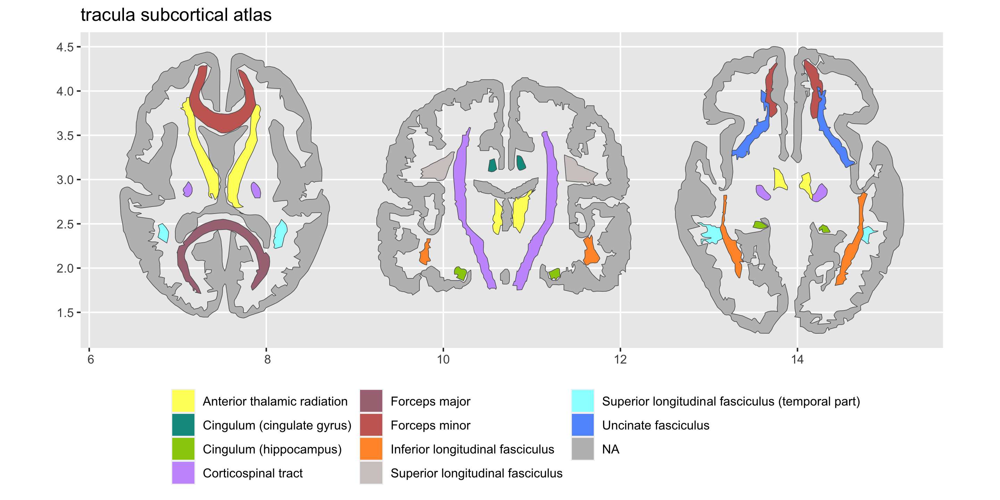

<!-- README.md is generated from README.Rmd. Please edit that file -->

# ggsegTracula

<!-- badges: start -->

[](https://travis-ci.com/LCBC-UiO/ggsegTracula)
[](https://ci.appveyor.com/project/LCBC-UiO/ggsegTracula)
[](https://codecov.io/gh/LCBC-UiO/ggsegTracula?branch=master)
<!-- badges: end -->

This package contains dataset for plotting the Tracula white matter
tracts with ggseg and ggseg3d.

## Installation

You can install the released version of ggsegTracula from
[GitHub](https://github.com/) with:

``` r
# install.packages("remotes")
remotes::install_github("LCBC-UiO/ggsegTracula")
```

``` r
library(ggseg)
library(ggseg3d)
library(ggsegTracula)

ggseg(atlas = tracula, mapping = aes(fill = region)) +
  scale_fill_brain("tracula", package = "ggsegTracula") +
  theme(legend.position = "bottom", 
        legend.text = element_text(size = 9)) +
  guides(fill = guide_legend(ncol = 3))
```



Please note that the ‘ggsegTracula’ project is released with a
[Contributor Code of Conduct](CODE_OF_CONDUCT.md). By contributing to
this project, you agree to abide by its terms.
